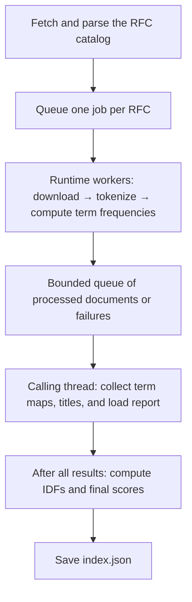

# rfsee

Search and view RFCs from the terminal.  A [TF-IDF](https://en.wikipedia.org/wiki/Tf%E2%80%93idf) index is built on the contents of all RFCs from the [IETF](https://www.ietf.org/rfc/rfc-index.txt) and then saved locally in a JSON file.  A CLI app is provided for searching this index, with output that can be piped to other tools such as editors.

## Install

Currently the CLI app can only be installed with [cargo](https://doc.rust-lang.org/cargo/getting-started/installation.html).

## Getting Started

After installing, you can run the following to create the index.

```bash
rfsee index
```

The runtime's worker thread count defaults to the available parallelism of the machine. Override
it with the global `--parallelism` flag, for example `rfsee index --parallelism 4` or
`rfsee --parallelism 4 index`.

Then, to execute a query its as simple as 

```bash
rfsee search --terms MY_SEARCH_TERMS
```

In a terminal, search opens an inline result picker showing up to ten results at a time.
Use Up/Down (or k/j) to navigate, Home/End to jump, and Enter to open the selected RFC
in your default browser. Esc, q, or Ctrl-C dismisses the picker. The picker clears itself when it exits.
It uses the normal terminal screen and may scroll earlier output upward to make room.

Use `rfsee search --terms HTTP --plain` for tab-separated output with `url`, `title`,
and `score` columns. Redirecting or piping output, or redirecting input, also selects
TSV automatically. Plain output contains every result; an empty search prints only
the header row.

Use `--min-score` to show only results strictly above a score threshold. The value uses
the same decimal scale as the displayed `score` column:

```bash
rfsee search --terms HTTP --min-score 0.001
```

To apply the threshold to every search, create `~/.config/rfsee/config.toml`:

```toml
min_score = 0.001
```

The `--min-score` flag overrides the config file. The default is `0.001` when neither
sets it. Use `--config PATH` to load a different config file.

Logging is controlled with repeatable `-v` flags. Logs are written to standard error so search
results can still be piped to another program.

- `-v` shows major stages such as loading, indexing, saving, and searching.
- `-vv` also shows timings, paths, counts, and periodic progress.
- `-vvv` also shows each RFC fetch or skip and per-term match counts.

The flag may appear before or after the subcommand, for example `rfsee -vv index` or
`rfsee search -vv --terms HTTP`.

## System design

rfsee separates building an index from searching it. The CLI in `crates/cli` handles
commands, logging, and file paths; `crates/tf_idf` implements fetching, parsing,
index construction, and ranking. There is no background service: `index` builds and
saves a local snapshot, and `search` loads that snapshot without fetching RFCs.

### Indexing pipeline



The CLI creates one `Runtime` for the process. It owns a reusable thread pool whose
size comes from `--parallelism`, defaulting to the available CPU parallelism with
a fallback of one worker. The calling thread first downloads and parses the RFC
catalog, then submits the document jobs to that pool.

Each worker downloads a complete RFC response before tokenizing it. It counts word
occurrences and normalizes them by the document's total token count to produce a
term-frequency map. Tokenization preserves case and reuses a compiled regular
expression. Raw text is dropped before the worker sends its result.

Processing therefore streams across completed documents: workers can tokenize one
RFC while other RFCs are still downloading. The result queue holds at most as many
results as there are workers; a full queue blocks further sends. Submitted jobs
are queued upfront, so this bound applies to completed results, not all queued work.

The calling thread owns the index state and consumes results as they arrive. It
stores document titles and term-frequency maps, records individual failures, and
invokes progress callbacks on that same thread. A catalog fetch or parse failure
aborts loading; individual document errors are recorded and skipped.

### Scoring, storage, and memory

Final scoring waits for every result because
[inverse document frequency](https://nlp.stanford.edu/IR-book/html/htmledition/inverse-document-frequency-1.html)
depends on the completed corpus: both the number of indexed documents and the number
containing each term. `finish()` counts those document frequencies, computes IDFs,
and combines them with each document's term frequencies. rfsee scales and rounds
the resulting scores to integers.

The saved `Index` contains two mappings: RFC number to title, and term to RFC numbers
and their scores. This inverted layout lets search retrieve the documents matching
a term directly. Raw text and intermediate term-frequency maps are not serialized.

Streaming limits buffered document text, but memory still grows with the corpus.
All per-document term maps remain in `TfIdf` while the final score index is built,
and both remain alive during saving. The runtime and its workers also live until
the CLI exits. Indexing rebuilds the snapshot; it does not incrementally update the
previous index.

### Search

Each `search` invocation loads the complete saved index into memory, splits the
query on spaces, and looks up each term exactly as written. Matching is
case-sensitive, with no stemming or query punctuation normalization. Documents
matching any query term are candidates; their matching scores are summed and
sorted in descending order. Results contain titles and RFC Editor URLs constructed
from the RFC numbers.

## Memory profiling

The profiler measures the indexing implementation described in [System design](#system-design).
Choose a profile based on what you want to measure:

| Profile | Workload | Stages reported | Intended use |
| --- | --- | --- | --- |
| `synthetic` | A deterministic corpus buffered in memory, processed without network I/O or a worker pool. | `input`, `ingest`, `finish` | Repeatable comparisons of document processing and scoring. Does not exercise the production streaming pipeline. |
| `actual` | The live RFC corpus, loaded through the production indexing API. | `load_and_ingest`, `finish` | End-to-end loading and scoring measurements. Results depend on the corpus, fetch outcomes, network, machine, and parallelism. |

The stage names identify measurement boundaries:

- `input`: synthetic corpus generation.
- `ingest`: processing the synthetic documents.
- `load_and_ingest`: the complete production loading call, including fetching and processing.
- `finish`: corpus-wide scoring and construction of the searchable index.

Neither profile measures serialization to `index.json`. Use `just profile-build-index`
to measure the complete CLI process, including saving the index.

Run either memory profile with:

```bash
RFSEE_BENCH_DOCS=100 just profile-bench-memory synthetic
just profile-bench-memory actual
```

`RFSEE_BENCH_DOCS` applies only to the synthetic profile. The actual profile always
attempts the complete live RFC corpus.

Each run appends one row per stage to `benches/memory-profile.csv`. The `profile` column
distinguishes synthetic and actual results. Stage timing uses a monotonic clock:
`start_elapsed_ms` and `end_elapsed_ms` are millisecond offsets from the beginning of the
run, and `duration_ms` is their difference. The memory columns have the following
meanings:

- `alloc_count`: allocations made during the stage.
- `retained_bytes`: signed change in live heap during the stage; it can be negative when
  the stage frees more memory than it retains.
- `peak_growth_bytes`: highest live heap during the stage minus live heap at stage start.
- `heap_start_bytes`, `heap_end_bytes`, and `heap_peak_bytes`: allocator-tracked live heap
  at the stage boundaries and high-water point.
- `run_peak_heap_bytes`: allocator-tracked high-water heap for the complete run.
- `peak_rss_kib`: operating-system process high-water RSS for the complete run. Compare
  this only across runs on the same system.

## Contributing

This is a personal project that I am using to explore and learn to build an application with minimal dependencies - as such I will likely not be accepting outside contributions.  That being said bug reports are always welcome.
